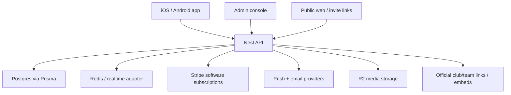

# Anstoss Threat Model

Updated: 2026-09-08

## Executive summary

Anstoss is a multi-tenant club-operations platform for amateur clubs. The highest-risk areas are tenant authorization, staff-role approval, invites and join requests, youth/guardian privacy, chat moderation, public club metadata, and payment wording/compliance. The release posture is intentionally conservative:

- Player/member contributions are tracked as real-world club bank transfers. Anstoss does not collect or hold those funds.
- Stripe is only for Anstoss software subscriptions and must not be exposed as a mobile external checkout in store-submitted builds.
- FUSSBALL/DFB links are supporting club/team context. Clubs can paste official links or embeds where supported; manual fixture entry remains the fallback. This release does not claim independent fixture import/synchronization.
- Chat retention is opt-in and operator-gated. It must not run globally without pilot approval, dry-run counts, and rollback criteria.
- Minors require guardian-aware communication rules; open adult-to-minor DMs are out of scope.

## Scope and assumptions

- In scope: `apps/mobile`, `apps/api`, `apps/admin`, `apps/web`, and `packages/shared` runtime behavior.
- Out of scope: Expo/EAS internals, app-store review systems, Stripe internals, Cloudflare internals, and developer-only local tooling.
- Assumption: production uses an internet-facing NestJS API, Postgres via Prisma, Expo iOS/Android clients, the admin web console, Cloudflare/R2 for media, Redis-backed rate limits/realtime support where configured, push notifications, email delivery, and store-compliant public web/legal pages.
- Assumption: clubs own their member/contribution data; Anstoss processes it for club operations.
- Assumption: paid Pro/Scale acquisition is not public in the mobile store build until the acquisition flow is finalized and approved for store compliance.

Open items that must be evidenced before broad launch:

- Real-club pilot metrics for fixture reliability, availability-response rate, contribution-reminder usefulness, and reduced WhatsApp chasing.
- Store-console completion for Google Play App Signing, Data Safety, content rating, listing, internal/pre-launch tests, and final production AAB upload.
- Legal/privacy review for youth data, retention, bank-import retention, and club controller/processor responsibilities.

## System model

| Component | Runtime responsibility | Main risks |
|---|---|---|
| Mobile app | Auth/session UX, onboarding, role-aware home, events, chat, squad, profile, invites, contribution status | stale sessions, unsafe external links, youth privacy, offline/double-submit UX |
| API | Tenant-scoped REST/realtime backend, role checks, invites, join requests, chat, events, contributions, billing state | cross-club access, role escalation, rate-limit gaps, destructive jobs |
| Admin web | Platform/admin operations, club verification, super-admin tools, grants, moderation queues | privileged-account abuse, missing audit trail, accidental destructive action |
| Web/legal pages | Public landing, legal, join/deep-link surfaces | public metadata leakage, incorrect store/payment claims |
| Postgres/Prisma | Source of truth for users, clubs, roles, teams, events, chat, claims, contributions | tenant-scope regression, migration/data-retention mistakes |
| R2/media | Chat/profile/club media storage | orphaned media, unsafe public attachment URLs, moderation evidence loss |
| Stripe | Anstoss software subscription lifecycle only | webhook misconfiguration, entitlement drift, store-policy wording errors |

## Trust boundaries

## Assets and security objectives

| Asset | Objective |
|---|---|
| User identity, email, DOB, guardian links | Confidentiality and integrity |
| Club membership, owner/admin/coach roles | Integrity and immediate revocation |
| Invites, QR/link campaigns, join requests | Integrity, anti-abuse, quota safety |
| Chat messages, attachments, reports | Confidentiality, moderation evidence retention, safe deletion |
| Contribution plans/status/bank references | Integrity, privacy, no fund custody by Anstoss |
| Software subscription/entitlement state | Integrity and store-policy compliance |
| Audit logs | Tamper-resistant operational evidence |
| Public club metadata | Controlled disclosure |

## Primary threats and required controls

| ID | Threat | Required controls |
|---|---|---|
| TM-001 | Cross-club read/write through missing tenant context | Tenant middleware plus service-level club/role assertions, negative cross-tenant tests for every sensitive route |
| TM-002 | Coach/admin privilege escalation | OWNER/ADMIN approval boundaries, “no self-approval”, audit logs, immediate REST/realtime revocation |
| TM-003 | Invite abuse or replay | Expiry, revocation, recipient binding where applicable, quota locks, public-code rate limits, redemption transaction checks |
| TM-004 | Youth privacy breach in chat/search | Minor projection rules, guardian-only DMs where required, no DOB/contact exposure in directory, blocking/reporting |
| TM-005 | Chat/media retention deletes evidence or orphaned objects | Opt-in retention, dry-run counts, unresolved-report exclusion, delete object before clearing DB pointer, retryable failures |
| TM-006 | Incorrect payment/store claims | Automated copy scanner across generated/base locales, no mobile external checkout links, clear bank-transfer contribution wording |
| TM-007 | Stripe subscription drift | Webhook signature verification, idempotent events, stale-event handling, operational alerts when Stripe is configured |
| TM-008 | Fixture-source/legal risk | Store official links/embeds only for this release; no unapproved scraping/import workaround; manual fixture fallback |
| TM-009 | Public endpoint brute force | Anonymous/IP rate limits, invite-code miss monitoring, WAF rules for bursts |
| TM-010 | Stale mobile session after role removal | Access-change events disconnect sockets, token refresh/session handling, server-side checks on every mutation |

## Release gates

Before public store release, the repo and operational environment need:

- Full API/mobile/admin tests, type checks, lint, Prisma validation, and store-copy audit.
- Migration dry-run on production-shaped data.
- Fresh iOS TestFlight and Android production AAB artifacts from the final commit.
- Internal tester install on iOS and Android, including login/onboarding, club claim/approval, invites, chat, events, squad, profile, contribution tracking, and admin verification.
- Pilot evidence for the real-club metrics that automated tests cannot prove.
- Documented rollback/disable flags for chat retention, fixture ingestion, billing acquisition, push, and invite campaigns.
