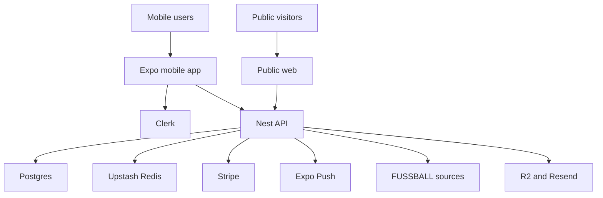

# Anstoss Threat Model

## Executive summary
Anstoss is a multi-tenant club-operations platform with real-user PII, youth-consent data, payment state, public invite links, and third-party fixture ingestion. The highest-risk areas are the public invite surface, external URL fetching in the FUSSBALL integration, and any authorization regression that bypasses tenant scoping or club-role checks. The strongest existing controls are Clerk-backed auth, Prisma tenant middleware, role guards, SecureStore-backed mobile session caching, and Stripe webhook signature verification when configured.

## Scope and assumptions
- In scope: `apps/mobile`, `apps/api`, `apps/web`, and `packages/shared` runtime behavior.
- Out of scope: CI/CD internals, Expo/EAS infrastructure, Clerk-hosted internals, Stripe internals, and non-runtime local developer tooling.
- Assumption: production deployment is an internet-exposed NestJS API plus public web routes, with Expo mobile clients for iOS and Android.
- Assumption: the product is multi-tenant at club level and stores user identity, team membership, youth/guardian data, push tokens, invite metadata, billing state, and club-facing public metadata.
- Assumption: accepted fixture scope is `fixtures + results + table + venue + kickoff`, and the operational source is third-party `api-fussball.de` plus FUSSBALL page parsing.
- Assumption: the real billing model is member dues with automatic reminders and failure recovery, even though that workflow is not fully implemented yet.

Open questions that would materially change the risk ranking:
- Whether API egress is restricted at the infrastructure layer; that affects SSRF impact for the FUSSBALL import flow.
- Whether public club pages will expose youth fixtures by default; that affects privacy expectations for minors.
- Whether billing and legal deletion/export workflows will be implemented in-app or handled externally at launch.

## System model
### Primary components
- `apps/mobile`: Expo React Native client using Clerk Expo, SecureStore token caching, and direct API calls. Evidence: `apps/mobile/app/_layout.tsx`, `apps/mobile/src/auth/token-cache.ts`, `apps/mobile/app/(auth)/sign-in.tsx`.
- `apps/api`: NestJS REST API with Clerk JWT verification, club-role authorization, tenant scoping, Stripe billing, push notifications, invite redemption, join requests, and FUSSBALL integration. Evidence: `apps/api/src/auth/clerk.guard.ts`, `apps/api/src/auth/roles.guard.ts`, `apps/api/src/prisma/tenant.middleware.ts`, `apps/api/src/billing/billing.controller.ts`, `apps/api/src/integrations/fussball.provider.ts`.
- `apps/web`: public web join/legal surface for invite landing pages and legal pages. Evidence: `apps/web/src/join.html`, `apps/web/src/legal.html`.
- `packages/shared`: shared enums, schemas, and app errors used on both client and server. Evidence: `packages/shared/src/types/roles.ts`, `packages/shared/src/schemas/club.ts`, `packages/shared/src/schemas/notification.ts`.
- Data stores and external services: Postgres via Prisma, Upstash Redis for rate limiting and chat adapter, Stripe, Clerk, Expo Push API, Resend, Cloudflare R2, and `api-fussball.de`. Evidence: `apps/api/src/prisma/prisma.service.ts`, `apps/api/src/rate-limit/rate-limit.guard.ts`, `apps/api/src/billing/billing.service.ts`, `apps/api/src/push/push.service.ts`, `apps/api/src/integrations/fussball.provider.ts`.

### Data flows and trust boundaries
- Mobile app -> Clerk: email-code auth, session establishment, token retrieval. Channel: HTTPS SDK calls. Security guarantees: Clerk-managed auth, mobile token cached in SecureStore. Validation: Clerk verification state handling in client. Evidence: `apps/mobile/app/(auth)/sign-in.tsx`, `apps/mobile/src/auth/token-cache.ts`.
- Mobile app -> API: authenticated REST calls with Bearer token for club, event, invite, billing, notification, and fixture actions. Channel: HTTPS. Security guarantees: `ClerkAuthGuard`, `AgeGateGuard`, `RolesGuard`, shared Zod parsing on many write routes, per-user rate limits on authenticated routes. Validation: request body parsing and club-role checks. Evidence: `apps/api/src/auth/clerk.guard.ts`, `apps/api/src/auth/roles.guard.ts`, `apps/api/src/rate-limit/rate-limit.guard.ts`.
- Public web/browser -> API public routes: invite lookup, slug-based invite lookup, club lookup, club summary, deep-link metadata. Channel: HTTPS. Security guarantees: route decorators mark read limits, but current limiter depends on authenticated `request.user.id`. Validation: invite code validation and slug matching. Evidence: `apps/api/src/public/public.controller.ts`, `apps/api/src/public/public.service.ts`, `apps/api/src/rate-limit/rate-limit.guard.ts`.
- API -> Postgres via Prisma: user, club, membership, invite, billing, fixture, and notification persistence. Channel: DB connection. Security guarantees: Prisma tenant middleware injects `clubId` for tenant-scoped models; service-level auth for non-tenant-scoped relations. Validation: middleware and guard composition. Evidence: `apps/api/src/prisma/prisma.service.ts`, `apps/api/src/prisma/tenant.middleware.ts`.
- API -> Upstash Redis: per-user read/write rate limiting and chat infrastructure. Channel: network client. Security guarantees: authenticated user keys for current limiter. Validation: none for anonymous traffic. Evidence: `apps/api/src/rate-limit/rate-limit.guard.ts`, `apps/api/src/chat/chat.gateway.ts`.
- API -> Stripe: Connect onboarding, subscriptions, webhook processing. Channel: HTTPS/webhooks. Security guarantees: admin/owner role checks on billing actions, webhook signature verification when secret exists. Validation: raw-body signature check. Evidence: `apps/api/src/billing/billing.controller.ts`, `apps/api/src/billing/billing.service.ts`.
- API -> Expo Push: push fanout to registered tokens. Channel: HTTPS. Security guarantees: token registration is authenticated, quiet-hours and mute checks filter recipients. Validation: invalid token cleanup only after Expo response. Evidence: `apps/api/src/push/push.controller.ts`, `apps/api/src/push/push.service.ts`.
- API -> FUSSBALL sources: fetches team page HTML and structured data from `api-fussball.de`. Channel: outbound HTTPS. Security guarantees: caller must have team manage access, but current URL normalization trusts arbitrary parseable URLs. Validation: token required for `api-fussball.de`; host validation missing for page fetch. Evidence: `apps/api/src/integrations/fussball.service.ts`, `apps/api/src/integrations/fussball.provider.ts`.

#### Diagram

## Assets and security objectives
| Asset | Why it matters | Security objective (C/I/A) |
|---|---|---|
| User identities, emails, DOB, guardian data | Includes youth-related PII and consent-sensitive data | C, I |
| Club memberships and role assignments | Governs access to teams, billing, invites, and admin workflows | I |
| Public invite codes and invite metadata | Controls onboarding and can expose club/youth data if leaked | C, I |
| Payment and subscription state | Drives dues collection, entitlements, and club revenue | I, A |
| Push tokens and notification preferences | Controls delivery of private operational updates | C, I |
| Fixture imports and overlays | Drives schedules, results, and logistics shown to members | I, A |
| Audit and consent records | Needed for GDPR defensibility and abuse investigation | I, A |
| Mobile session tokens | Persistent authentication for end users | C, I |

## Attacker model
### Capabilities
- Remote unauthenticated attacker can hit public invite and club routes.
- Authenticated low-privilege user can exercise normal app flows and attempt privilege escalation or data overreach.
- Authenticated club manager can trigger invite, fixture import, and some external-service flows.
- Opportunistic attacker can scrape public metadata or brute-force weakly protected public endpoints.
- Operator mistakes are realistic: missing webhook secrets, dev-mode misconfiguration, or permissive outbound networking.

### Non-capabilities
- No assumption of direct database access.
- No assumption that attacker controls Clerk or Stripe internals.
- No assumption of local device compromise beyond normal lost/stolen-device risk.
- No assumption of arbitrary code execution inside the API unless another abuse path enables it.

## Entry points and attack surfaces
| Surface | How reached | Trust boundary | Notes | Evidence (repo path / symbol) |
|---|---|---|---|---|
| Mobile sign-in flow | User enters email/code in app | User -> Mobile -> Clerk -> API | Session establishment and first-login onboarding | `apps/mobile/app/(auth)/sign-in.tsx` |
| Clerk JWT auth | Bearer token on API routes | Mobile -> API | JIT user creation, dev bypass in development mode | `apps/api/src/auth/clerk.guard.ts` |
| Public invite lookup | `GET /public/invites/:code`, `GET /join/:clubSlug/:code` | Public internet -> API | Public payload currently includes invite-linked PII | `apps/api/src/public/public.controller.ts`, `apps/api/src/public/public.service.ts` |
| Public club lookup | `GET /public/clubs/:slug` | Public internet -> API | Club badge, counts, and branding exposed | `apps/api/src/public/public.controller.ts` |
| Invite redemption | Authenticated invite redeem path | User -> API -> DB | Role and parental-consent transitions | `apps/api/src/invites/invites.service.ts` |
| Join requests | Authenticated club discovery/join flow | User -> API -> DB | Sensitive because it creates memberships and pending approvals | `apps/api/src/clubs/join-requests.controller.ts`, `apps/api/src/clubs/join-requests.service.ts` |
| Billing actions | Admin/owner billing routes | Admin user -> API -> Stripe | Creates Connect onboarding and subscriptions | `apps/api/src/billing/billing.controller.ts`, `apps/api/src/billing/billing.service.ts` |
| Stripe webhooks | `POST /billing/webhooks/stripe` | Stripe -> API | Signature-verified only if secret configured | `apps/api/src/billing/billing.controller.ts`, `apps/api/src/billing/billing.service.ts` |
| Push token registration | Authenticated push routes | Mobile -> API -> DB | Associates tokens to users and affects private messaging | `apps/api/src/push/push.controller.ts`, `apps/api/src/push/push.service.ts` |
| FUSSBALL link preview/sync | Team manager integration UI | Manager -> API -> external URLs | Current provider accepts arbitrary parseable URLs | `apps/api/src/integrations/fussball.provider.ts`, `apps/api/src/integrations/fussball.service.ts` |
| Notification preference upsert | Authenticated club route | User -> API -> DB | Bulk/team preference behavior impacts delivery privacy | `apps/api/src/notifications/notifications.controller.ts`, `apps/api/src/notifications/notifications.service.ts` |

## Top abuse paths
1. Attacker scrapes public invite endpoints, brute-forces invite codes, and learns recipient/guardian emails or child names from returned payloads.
2. Attacker obtains or guesses a valid invite URL and uses missing anonymous rate limits to enumerate more invite metadata at scale.
3. Authenticated manager submits a malicious URL to the FUSSBALL preview flow, causing server-side fetches to attacker-chosen destinations.
4. Authenticated club user hunts for endpoints or model paths that are not fully covered by tenant middleware and attempts cross-club reads or writes.
5. Misconfigured production environment runs with development auth assumptions or unsafe Clerk keys, weakening release auth guarantees.
6. Operator deploys billing without `STRIPE_WEBHOOK_SECRET`; payment state stops reconciling and dues/reminders drift from Stripe truth.
7. Third-party fixture provider becomes unavailable or returns bad data; schedules, results, or tables become stale or incorrect in the app.
8. Attacker steals an unlocked device and reuses persisted mobile session until logout/expiry or account revocation takes effect.

## Threat model table
| Threat ID | Threat source | Prerequisites | Threat action | Impact | Impacted assets | Existing controls (evidence) | Gaps | Recommended mitigations | Detection ideas | Likelihood | Impact severity | Priority |
|---|---|---|---|---|---|---|---|---|---|---|---|---|
| TM-001 | Unauthenticated remote attacker | Access to public API routes; no auth needed | Enumerate public invite and club routes without effective rate limiting | Invite scraping, brute-force, abuse amplification | Invite metadata, club metadata, API availability | Public routes marked with `@RateLimit('read')` in `apps/api/src/public/public.controller.ts` | `RateLimitGuard` only limits when `request.user.id` exists, so anonymous public traffic is effectively not limited in `apps/api/src/rate-limit/rate-limit.guard.ts` | Add IP- or token-based anonymous rate limiting, WAF rules, and abuse logging for public routes | Track 404/400 bursts on public invite routes, IP cardinality, and repeated slug/code misses | High | High | high |
| TM-002 | Unauthenticated remote attacker | Valid, guessed, or leaked invite code | Read invite-linked PII from public payloads | Exposure of recipient email, guardian email, child name, and youth onboarding metadata | Youth/guardian PII, invite secrecy | Invite validity checks and slug matching in `apps/api/src/public/public.service.ts` | `getInvite()` returns `recipientEmail`, `guardianEmail`, and `childName` on public responses in `apps/api/src/public/public.service.ts` | Remove PII from public invite payloads, return only minimal display info, and gate sensitive metadata behind authenticated redemption | Alert on public invite hits that return now-redacted fields during rollout testing; audit invite lookup volume | Medium | High | high |
| TM-003 | Authenticated manager or compromised manager account | Manage access to a team and ability to submit integration input | Supply arbitrary URL for FUSSBALL preview/sync to trigger server-side fetches | SSRF, internal probing, unexpected outbound traffic | Internal services, API egress trust, credentials reachable via network | Team-manage access required before create/sync in `apps/api/src/integrations/fussball.service.ts` | `buildTeamPageUrl()` accepts any parseable URL and `fetchTeamPage()` fetches it in `apps/api/src/integrations/fussball.provider.ts` | Restrict to approved FUSSBALL hosts or canonical IDs, disallow custom schemes/ports/private ranges, and follow only safe redirects | Log outbound target hostnames for fixture sync, alert on non-FUSSBALL hosts and private-IP resolution attempts | Medium | High | high |
| TM-004 | Authenticated club user exploiting authZ gaps | Valid account and ability to hit club routes | Find a controller/service path that is not fully covered by tenant or role enforcement | Cross-club data access or mutation | Memberships, events, messages, invites, fixtures | Tenant middleware auto-injects `clubId` for many models in `apps/api/src/prisma/tenant.middleware.ts`; role checks in `apps/api/src/auth/roles.guard.ts` | Some relation-scoped models rely on service-layer checks; read actions on tenant-scoped models pass through if no club context exists | Review all non-tenant-scoped relation paths, require explicit club context for sensitive reads, and add cross-tenant negative tests | Add security tests for cross-club access and monitor `TenantScopeViolationError` frequency | Medium | High | high |
| TM-005 | Operator misconfiguration or malicious webhook sender | Billing deployed with missing or wrong webhook secret | Break or spoof payment reconciliation behavior | Incorrect dues state, entitlement drift, missed failures | Billing state, dues workflows, audit history | Signature verification when `STRIPE_WEBHOOK_SECRET` exists in `apps/api/src/billing/billing.service.ts`; role restrictions in `apps/api/src/billing/billing.controller.ts` | If secret is missing, handler returns success without processing, creating silent integrity/availability drift | Fail closed on missing webhook secret in production, add startup config checks, and add billing health alarms | Alert when webhook secret missing, webhook volume is zero, or Stripe status diverges from local subscription state | Medium | Medium | medium |
| TM-006 | Third-party provider failure or data tampering | Dependence on `api-fussball.de` and HTML parsing | Return stale, malformed, or manipulated fixture data | Wrong schedules, wrong tables, operational confusion | Fixture integrity, club trust, match logistics | FUSSBALL imports are scoped to managers and typed into normalized fixtures in `apps/api/src/integrations/fussball.service.ts` | No official DFB native data contract is visible in repo; provider and HTML parsing are external trust dependencies | Add provider health checks, freshness indicators, sync retry/backoff, provenance labeling, and manual override workflow for critical match data | Monitor sync failure rate, stale fixture age, and mismatch reports from club admins | High | Medium | medium |
| TM-007 | Operator auth misconfiguration | Production build or API runs with unsafe auth config | Weaken authentication guarantees or enable dev-only shortcuts | Unauthorized access or unsafe release behavior | User accounts, club data, payment/admin actions | Mobile runtime blocks unsafe Clerk publishable keys in release builds in `apps/mobile/src/config/runtime.ts`; API dev bypass checks `NODE_ENV === 'development'` in `apps/api/src/auth/clerk.guard.ts` | API dev bypass remains catastrophic if production env is mis-set; mobile guard does not protect server-side config | Add startup hard-fail for production when `NODE_ENV !== 'production'`, add release env validation in API, and rotate away from dev/test credentials before shipping | Emit startup warnings to fatal logs, verify env in health/admin endpoint, and alert on `dev_` token usage | Low | High | medium |
| TM-008 | Lost/stolen device or local malware | Access to an unlocked device or compromised session | Reuse persisted mobile session token | Ongoing account access until logout/expiry | Session tokens, user account access | Clerk token cache uses SecureStore in `apps/mobile/src/auth/token-cache.ts`; sign-out clears local state in `apps/mobile/src/context/AuthContext.tsx` | No repository evidence of forced device/session revocation UI, suspicious-session detection, or remote sign-out controls | Add account/device session management, explicit re-auth for sensitive actions, and session expiry UX for long-lived pilots | Track repeated token-expired events, new device registrations, and device-to-user token churn | Medium | Medium | medium |

## Criticality calibration
- `critical`: direct auth bypass, cross-tenant exfiltration of club/youth data, or payment/admin takeover with low attacker effort.
  - Example: production dev-auth bypass accepting `dev_` tokens.
  - Example: unguarded endpoint exposing another club’s memberships or consent records.
  - Example: arbitrary SSRF reaching internal metadata or credential services.
- `high`: concrete data leak or privilege abuse with meaningful user harm, but with some precondition such as valid invite discovery or authenticated manager access.
  - Example: public invite lookup leaking guardian email and child name.
  - Example: anonymous public route brute-force because rate limits do not apply.
  - Example: manager-triggered SSRF limited by required club-manage access.
- `medium`: important integrity or availability risk, or a security issue whose exploitability depends on operator misconfiguration or third-party compromise.
  - Example: Stripe webhook secret missing so dues state silently drifts.
  - Example: third-party fixture provider failure corrupts schedule truth.
  - Example: stolen device session reuse without stronger session management.
- `low`: low-sensitivity metadata exposure or issues requiring unrealistic attacker control not supported by the current deployment model.
  - Example: public platform info route branding disclosure.
  - Example: minor UI-only localization mismatches without data impact.
  - Example: low-value scraping of already-public club branding.

## Focus paths for security review
| Path | Why it matters | Related Threat IDs |
|---|---|---|
| `apps/api/src/public/public.service.ts` | Public invite payload assembly currently includes sensitive fields | TM-001, TM-002 |
| `apps/api/src/public/public.controller.ts` | Public routes define exposed unauthenticated surfaces | TM-001, TM-002 |
| `apps/api/src/rate-limit/rate-limit.guard.ts` | Current limiter design skips anonymous requests entirely | TM-001 |
| `apps/api/src/integrations/fussball.provider.ts` | Arbitrary URL normalization and outbound fetch logic create SSRF risk | TM-003, TM-006 |
| `apps/api/src/integrations/fussball.service.ts` | Manager-facing integration flow and sync behavior define external trust boundary | TM-003, TM-006 |
| `apps/api/src/prisma/tenant.middleware.ts` | Core tenant isolation control; regression here is severe | TM-004 |
| `apps/api/src/auth/roles.guard.ts` | Club-role authorization chokepoint | TM-004 |
| `apps/api/src/auth/clerk.guard.ts` | Auth verification, JIT user creation, and dev bypass logic | TM-007 |
| `apps/api/src/billing/billing.service.ts` | Stripe webhook verification, subscription state, and Connect flow | TM-005 |
| `apps/mobile/src/auth/token-cache.ts` | Mobile session persistence and secure storage behavior | TM-008 |
| `apps/mobile/src/context/AuthContext.tsx` | Sign-out handling, token wiring, and stale session recovery | TM-008 |
| `apps/api/src/invites/invites.service.ts` | Invite redemption, parental approval, and email matching logic | TM-002, TM-004 |

## Quality check
- Covered discovered public, authenticated, billing, push, invite, and integration entry points.
- Represented each major trust boundary in threats: public API, authenticated API, Stripe, push, DB, and FUSSBALL vendor flows.
- Kept runtime behavior separate from CI/dev tooling; only production-relevant auth misconfiguration is discussed.
- Incorporated user clarifications: lean native fixture scope, accepted `api-fussball.de` usage, and real member-dues model.
- Explicit assumptions and open questions are listed above.
